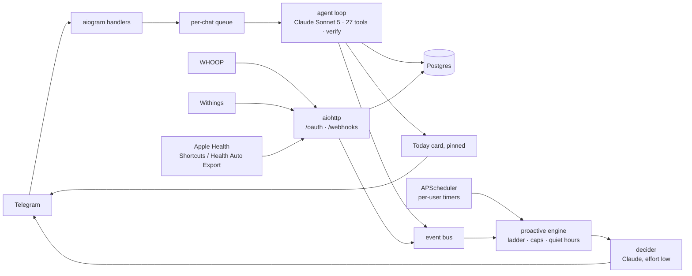

# Strikt

Strikt is a personal health coach that lives in one Telegram chat. You send it what you eat (a photo, a delivery-app screenshot, a label, a voice note, text), what you trained (a WHOOP screenshot, or a live WHOOP connection) and what you measured (a scale photo, "weighed 104.2"). It logs everything into Postgres, answers with the numbers first (kcal, protein, carbs, fat and fiber per item, the day so far, what is left), keeps a pinned "Today" card current, and writes first when you go quiet. It runs on Claude Sonnet 5, remembers from day one, and starts every new user with a ten-step interview instead of a settings screen. Three commands: `/start`, `/today`, `/forget_me`. Everything else is a message.

## How it feels

Examples in the voice the prompts enforce (`PROMPTS.md`), not transcripts.

**A lunch screenshot.** You send a delivery-app item that claims "520 kcal, 38 P, 26 C, 18 F".

> Chicken pasta — 690 kcal / 38 P / 70 C / 24 F / 4 fiber. Menu said 26 g carbs; a real pasta portion is 60–80. Loose food, +25 %.
> **Total** 1 120 kcal / 80 P / 80 C / 48 F / 4 fiber
> Left: 780 kcal · 100 P · 40 C · 32 F · 26 fiber
> Dinner has to carry 70+ g protein. Cottage cheese plate or a large meat dish.

**A challenge.** You write "recalculate, that doesn't add up".

> omelette, 3 eggs — 310 / 22 P / 2 C / 24 F
> Greek yogurt 0 %, 200 g — 120 / 20 P / 8 C / 0 F
> chicken pasta — 690 / 38 P / 70 C / 24 F
> Sum: 1 120 kcal / 80 P / 80 C / 48 F. Cross-check 80×4 + 80×4 + 48×9 = 1 072, within 5 %.
> Total stands. Left: 780 kcal · 100 P.

**A silent afternoon.** Nothing logged since breakfast; the bot writes first (ladder step 2).

> 14:10. Nothing since breakfast.
> Your last three days without lunch ended at 2 400+ kcal (22, 26 and 30 Aug).
> What are you eating in the next hour?

The pinned card (`telegram/render.py`), edited in place after every change. The exact output of `render_day_card` for these numbers, Telegram HTML tags stripped (`UX.md` shows the source):

```
Today · Thu 3 Sep
kcal  1 070 / 1 900   ▓▓▓▓▓░░░
P        90 /   180g  ▓▓▓▓░░░░
C        62 /   120g  ▓▓▓▓░░░░
F        50 /    80g  ▓▓▓▓▓░░░
fiber     6 /    30g  ▓▓░░░░░░
Left: 830 kcal · 90 P · 58 C · 30 F

Meals
• 09:10 breakfast — omelette, 3 eggs, Greek yogurt 0%, 200 g blueberries · 430
• 13:40 lunch — chicken shawarma pl… · 640
Training: strength · 62 min · strain 9.4 · 410 kcal · avg HR 118
Due: waist
```

Write in Russian and it answers in Russian, keeping English food names as written.

## Architecture

One process, one event loop: Telegram, the HTTP server for OAuth and webhooks, the scheduler and the model loop run inside `python -m strikt`. Postgres is the only other service.



A message: album parts are gathered for 1.2 s and merged; HEIC becomes JPEG, PDFs go in as documents, voice is transcribed; the message waits in its chat's queue (never dropped); the loop stores the turn, builds the context, calls the model with tools for up to 12 rounds (a response cut off inside a tool call is retried once with a doubled output cap), verifies, stores the reply, refreshes the card of every day the tools touched, picks the buttons for the meal this turn logged or corrected. A proactive trigger, from a timer or a webhook event, goes through one engine: precondition on real data, ladder step, quiet hours, daily cap, then the model writes the text or stays silent.

### Module map

| Path (`src/strikt/`) | What it owns |
|---|---|
| `app.py` | wiring, migrations on boot, start/stop |
| `config.py` | settings from `.env`, price table |
| `telegram/` | aiogram bot, handlers, per-chat queue, media (HEIC, albums, PDFs), voice, the card, buttons, ru/en copy |
| `agent/loop.py`, `context.py`, `verify.py` | the turn loop, context assembly and caching, the Reflexion check |
| `agent/tools/` | 27 tools: strict schemas, registry, handlers for food, training, body, state, profile, research, memory |
| `agent/prompts/` | coach, onboarding, proactive, verify, summarize, import (rendered into `PROMPTS.md`) |
| `nutrition/` | 4/4/9 math, sanity rules, units, Open Food Facts and USDA clients, food cache |
| `memory/` | day state, notes, day and week summaries, history retrieval |
| `proactive/` | scheduler job table, triggers, ladder, engine, send log |
| `integrations/` | WHOOP, Withings, Apple Health behind one `Integration` protocol; signed OAuth links |
| `web/server.py` | `/health`, `/oauth/*`, `/webhooks/*`, `/telegram` |
| `onboarding/` | the ten-step checklist and the history importer |
| `db/` | models (21 tables), repo, engine, Fernet cipher |
| `events.py`, `privacy.py`, `logging.py` | event bus, `/forget_me`, structlog with secret redaction |

## Why these choices

- **Python, async, typed.** `mypy --strict` over `src`; every tool argument is a pydantic model, so the model's output is never parsed as free text.
- **aiogram 3.31.** Tracks Bot API 10.3 (the main alternative stopped at 10.0); one dispatcher serves polling and the webhook.
- **Postgres 18.** The memory is typed rows, not a vector store: numbers live in tables, summaries cite them. Tests run the same models on SQLite. Migrations from day one.
- **APScheduler 3.11.** Per-user cron jobs in the user's timezone, in-process, recomputed when the profile changes. 4.x is still alpha.
- **Claude Sonnet 5 for everything.** Effort `medium` for turns, `low` for verify, proactive decisions, summaries and `web_research`. A cheaper second model was rejected: its 4,096-token cache minimum would silently skip caching the system block (`RESEARCH.md` §7).
- **OpenAI `gpt-transcribe` for voice.** Sonnet 5 takes text and images only. Telegram's OGG goes to OpenAI as is, no ffmpeg; `whisper-1` is the fallback. Optional.
- **Server-side web search in a separate call.** `web_research` is its own model call carrying Anthropic's `web_search` and `web_fetch` tools, so the main tool list never changes and the cache holds. It costs money, so it is for restaurant dishes, not for eggs. The tool type strings are settings (`WEB_SEARCH_TOOL_TYPE`, `WEB_FETCH_TOOL_TYPE`), so a renamed version is a config change, not a deploy; what comes back is marked untrusted and used as data, never as instructions.

**Caching layout.** Stable to volatile: tool definitions (sorted, byte-stable) → the coach prompt as `system[0]`, cached one hour → the profile block (profile, protocol, active notes, onboarding checklist) as `system[1]`, cached five minutes → the last 30 turns or 40K tokens, with a breakpoint on the last history block → the current message, which opens with a `<context>` block (local time, today's state, yesterday's close, the week summary, retrieved history for questions about the past, pending reminders) and ends with your text. Nothing in `system` depends on the clock.

**The Reflexion verify step.** Reflexion pays when the evaluator is cheap and objective and runs on failure only; here the evaluator is the database. After a meal tool, `get_day_state`, `import_history`, or a request to recalculate, the state of the day those tools reported (a dinner logged at 00:10 belongs to the evening's day; a reply that mixes days is not checked) is rebuilt from Postgres and every total the draft claims is compared with it (2 %, or 5 kcal / 1 g, whichever is larger). Only on a mismatch is the model called once more, at effort `low`, with the draft and the true numbers; if the rewrite is still wrong, the database line is appended. No self-critique on success, no second retry.

**Instinct and Reflexion, adopted and rejected.** The full table with sources is `RESEARCH.md` §1.

| Idea | Verdict | In Strikt |
|---|---|---|
| Reflexion with a deterministic evaluator | adopt, bounded | `agent/verify.py`, one rewrite |
| Bounded reflection memory | adopt, as curation | one verify trial per turn; a note supersedes its predecessor instead of piling up |
| Self-critique after every tool call | reject | doubles latency and cost; reflect on failure only |
| Vector database for memory | reject, defer | typed rows plus keyword search |
| "No new interface", one conversation | adopt | three commands, no web app, no settings |
| Cloud machine with cached browser credentials | reject | typed API tools; browser automation was Instinct's attack surface |
| Dispatcher plus recurring loops | adopt as a scheduler | APScheduler and an event bus enqueue model decisions |
| Proactive outreach | adopt, gated | quiet hours, five sends a day, ladder 1→4, reset on reply; your own reminders bypass quiet hours and the cap; `sick` and `travel` days pause the meal, protein and fiber nudges |
| Continue without confirming | reject | writes to its own database are autonomous; nothing leaves the system |
| Disconnect without delete | reject | `/forget_me` hard-deletes every row in one transaction |
| Training licence on user content | reject | no training on user data, no device capture |
| Invite-only rollout | adopt | `ALLOWED_TELEGRAM_IDS` plus invite codes |
| Goals with hard guardrails in code | adopt | sanity floors, quiet hours, caps and the escalation ceiling are code, not prompt |
| Immutable snapshots, traces, regression conversations | adopt | prompts versioned in the repo; every send and every token logged; fixtures from the brief |
| Constellation of models | minimal | one model, two effort levels |

## Deploy in fifteen minutes

You need a Linux machine with Docker Compose, a Telegram account and an Anthropic account with billing.

1. **Create the bot.** In Telegram open @BotFather, send `/newbot`, follow the prompts, copy the token. Then `/mybots` → the bot → *Bot Settings* → *Allow Groups?* → **Turn off**: the coach is a private chat, and it drops group updates anyway.
2. **Get an Anthropic key** from the Claude Console.
3. **Clone.** `git clone https://github.com/magik-ai/bomiso.git && cd bomiso`
4. **Configure.** `cp .env.example .env`. Fill `TELEGRAM_BOT_TOKEN`, `ANTHROPIC_API_KEY`, `ALLOWED_TELEGRAM_IDS` (your numeric Telegram id) and `ADMIN_TELEGRAM_IDS` (the same id, so you can mint invites). Change `POSTGRES_PASSWORD`. If you do not know your id, finish the steps, send `/start`, and read it from the `start_rejected` log line.
5. **Encryption key.** `make keygen` prints a `TOKEN_ENCRYPTION_KEY`; paste it into `.env`. It needs `uv`; without it, after step 6: `docker compose run --rm --no-deps bot python -c "from strikt.db.crypto import generate_key; print(generate_key())"`.
6. **Start.** `docker compose up -d --build`. Compose starts Postgres 18, waits for it to be healthy, runs `alembic upgrade head`, starts the bot.
7. **Check.** `docker compose logs -f bot` should show `migrations_done` and `strikt_started`; `curl localhost:8080/health` answers `{"status": "ok", ...}` (the port is published on 127.0.0.1 only; `WEB_PORT` in `.env` changes the host side).
8. **Name and avatar.** `TELEGRAM_BOT_TOKEN=... uv run python scripts/setup_telegram.py` sets the name, descriptions, commands and the avatar (`brand/avatar/avatar-512.jpg`). The bot sets commands and descriptions itself at start; this adds name and picture.
9. **Send `/start`.** Ten questions, resumable at any message, food logged along the way.

**Optional: a domain, HTTPS and webhooks.** WHOOP, Withings and Apple Health need a public HTTPS URL. Point a DNS record at the machine, open ports 80 and 443, set `CADDY_DOMAIN=coach.example.com` and `PUBLIC_BASE_URL=https://coach.example.com`, then `docker compose --profile tls up -d`. Caddy gets a Let's Encrypt certificate and proxies to the bot. For Telegram updates by webhook instead of polling, also set `TELEGRAM_MODE=webhook` and a `TELEGRAM_WEBHOOK_SECRET`; the bot registers `<PUBLIC_BASE_URL>/telegram` on start.

To invite someone: `/invite`, pass on the code, they send `/start <code>`. A code works once.

## Environment variables

The list from `.env.example`. Compose sets `DATABASE_URL` from `POSTGRES_PASSWORD` and forces `LOG_FORMAT=json`. Effort values: `low | medium | high | xhigh | max`.

| Variable | Required | Default | Meaning |
|---|---|---|---|
| `TELEGRAM_BOT_TOKEN` | yes | — | token from BotFather |
| `ALLOWED_TELEGRAM_IDS` | in practice | empty | comma-separated Telegram ids allowed to `/start` without a code |
| `ADMIN_TELEGRAM_IDS` | no | empty | ids that may `/invite`; admins are also allowed |
| `TELEGRAM_MODE` | no | `polling` | `polling` or `webhook` (needs HTTPS `PUBLIC_BASE_URL`) |
| `TELEGRAM_WEBHOOK_SECRET` | in webhook mode | — | secret Telegram sends with each webhook |
| `ANTHROPIC_API_KEY` | yes | — | Claude API key |
| `ANTHROPIC_MODEL` | no | `claude-sonnet-5` | model id for every call |
| `EFFORT_TURN` | no | `medium` | effort for chat turns |
| `EFFORT_VERIFY` | no | `low` | effort for the verify rewrite |
| `EFFORT_PROACTIVE` | no | `low` | effort for proactive decisions |
| `EFFORT_SUMMARY` | no | `low` | effort for day and week summaries |
| `EFFORT_RESEARCH` | no | `low` | effort for `web_research` |
| `MAX_TOKENS_TURN` | no | `8192` | output cap per turn (thinking counts) |
| `MAX_TOKENS_VERIFY` | no | `2048` | output cap for verify |
| `MAX_TOKENS_PROACTIVE` | no | `4096` | output cap for a proactive decision (thinking counts; the text itself is ≤ 350 chars) |
| `MAX_TOKENS_SUMMARY` | no | `4096` | output cap for summaries |
| `MAX_TOKENS_RESEARCH` | no | `8192` | output cap for research |
| `WEB_SEARCH_TOOL_TYPE` | no | `web_search_20260318` | server tool type string for `web_research` |
| `WEB_FETCH_TOOL_TYPE` | no | `web_fetch_20260318` | server tool type string for `web_research` |
| `MAX_TOOL_ROUNDS` | no | `12` | tool rounds per turn before the loop stops |
| `CONTEXT_MAX_TURNS` | no | `30` | turns of history sent each turn |
| `CONTEXT_MAX_TOKENS` | no | `40000` | history token cap, whichever comes first |
| `LLM_TIMEOUT_S` | no | `120` | HTTP timeout per model call |
| `OPENAI_API_KEY` | no | — | voice transcription only; without it voice notes get "send text" |
| `OPENAI_TRANSCRIPTION_MODEL` | no | `gpt-transcribe` | primary transcription model |
| `OPENAI_TRANSCRIPTION_FALLBACK_MODEL` | no | `whisper-1` | fallback when the primary errors |
| `DATABASE_URL` | no | bundled Postgres | async SQLAlchemy URL; Compose overrides it |
| `POSTGRES_PASSWORD` | no | `strikt` | password of the bundled Postgres; change it |
| `TOKEN_ENCRYPTION_KEY` | yes | — | Fernet key for tokens at rest; `make keygen` |
| `PUBLIC_BASE_URL` | for integrations | `http://localhost:8080` | public HTTPS base for OAuth callbacks and webhooks |
| `WEB_HOST` | no | `0.0.0.0` | interface the aiohttp server binds |
| `WEB_PORT` | no | `8080` | port the aiohttp server listens on; under Compose the host-side port only (the container always listens on 8080, published on 127.0.0.1) |
| `CADDY_DOMAIN` | with `--profile tls` | — | domain for the Caddy TLS profile |
| `WHOOP_CLIENT_ID` / `WHOOP_CLIENT_SECRET` | for WHOOP | — | WHOOP developer app |
| `WITHINGS_CLIENT_ID` / `WITHINGS_CLIENT_SECRET` | for Withings | — | Withings developer app |
| `USDA_API_KEY` | no | — | USDA FoodData Central key (`DEMO_KEY` works with low limits) |
| `OFF_USER_AGENT` | no | `Strikt/0.1 (...)` | User-Agent Open Food Facts asks for |
| `LOG_LEVEL` | no | `INFO` | `DEBUG | INFO | WARNING | ERROR | CRITICAL` |
| `LOG_FORMAT` | no | `pretty` | `json` in production (Compose forces it) |
| `PRICE_TABLE` | no | Sonnet 5 prices | JSON map model → USD per 1M tokens (`input`, `output`, `cache_read`, `cache_write`, optional `cache_write_1h`) and `web_search_per_1000` per 1,000 searches |
| `PROACTIVE_DAILY_CAP` | no | `5` | proactive messages per user per local day (`gentle` mode is fixed at 2; user-set reminders do not count) |
| `PROACTIVE_DAILY_CAP_DRILL_SERGEANT` | no | `8` | the cap in `drill_sergeant` mode |
| `PROACTIVE_FOLLOWUP_MINUTES` | no | `45` | minutes before an unanswered nudge escalates |
| `QUIET_START` / `QUIET_END` | no | `00:00` / `07:30` | default quiet hours; per-user values live in the profile |
| `RUN_MIGRATIONS` | no | `true` | run `alembic upgrade head` in-process on boot |
| `LOOSE_FOOD_BUFFER` | no | `0.25` | buffer on loose foods (pasta, rice, sauces, soups), 0–1 |

## Connecting WHOOP

WHOOP needs the domain and HTTPS from the deploy section.

1. Create an app at developer.whoop.com. Redirect URI: `<PUBLIC_BASE_URL>/oauth/whoop/callback`, exactly. Scopes: `offline read:recovery read:cycles read:sleep read:workout read:profile read:body_measurement` (`offline` gives the refresh token). Webhook URL: `<PUBLIC_BASE_URL>/webhooks/whoop`, model version v2.
2. Put the client id and secret into `.env` as `WHOOP_CLIENT_ID` and `WHOOP_CLIENT_SECRET`; `docker compose up -d` to restart.
3. In the chat write "connect WHOOP" (the interview offers it at step 5). The coach sends a link signed for your user, valid 24 hours; the OAuth state behind it is single-use, valid 10 minutes.
4. Log in to WHOOP and allow access. The callback page and a Telegram message confirm it and report what was pulled from the last 7 days.

From then on a finished workout, sleep or recovery arrives by webhook within minutes and the coach comments on it against your last session of that sport and your 30-day average. Signatures are checked against the client secret and a timestamp within five minutes; a poll every 30 minutes covers missed deliveries; tokens are Fernet-encrypted and refreshed when they are about to expire (or after a 401), one refresh at a time per user. Two WHOOP facts: an unapproved app is limited to 10 members, so file for approval early if you plan to invite people; and there is no sandbox, so the developer needs a WHOOP device.

## Connecting Withings

1. Create a developer app at developer.withings.com with callback `<PUBLIC_BASE_URL>/oauth/withings/callback`. Put the id and secret into `.env` as `WITHINGS_CLIENT_ID` and `WITHINGS_CLIENT_SECRET`; restart.
2. In the chat, "connect Withings". Open the link, allow `user.info,user.metrics,user.activity`.
3. The coach imports the last 30 days of readings and subscribes to weight notifications at `<PUBLIC_BASE_URL>/webhooks/withings`. Withings requires HTTPS on port 443 and a `HEAD` reply there; the Caddy profile gives you both.

Notifications are unsigned, so each one is only a hint: its dates are ignored, the readings are re-fetched with your own token from the stored sync cursor (at most once a minute per user), and the cursor moves only with the 30-minute sync, so a forged notification can neither skip a weigh-in nor burn your quota. A weigh-in is compared with your 7-day average, never judged alone.

## Connecting Apple Health

Anything that syncs into Apple Health (Renpho, Eufy, Xiaomi scales, Apple Watch, Garmin, Oura) reaches Strikt through one personal URL; no developer account needed. In the chat, "connect Apple Health": the coach answers with your URL, `<PUBLIC_BASE_URL>/webhooks/apple-health/<token>`, and these steps in your language. The token is your key; keep the URL private.

- **Option A, Health Auto Export (recommended).** Install "Health Auto Export – JSON+CSV". Automations → + → REST API: your URL, POST, JSON, export version 2, batch requests on. Data types: Health Metrics (weight, body fat, steps, resting HR, HRV, sleep) and Workouts, period "since last sync". Optional header `X-Strikt-Secret: <token>`. HealthKit is unreadable while the phone is locked, so add a Shortcuts "Time of Day" automation at 08:00 that runs its "Run Automation" action.
- **Option B, Shortcuts only.** "Find Health Samples" (Weight, last 1 day, limit 1) → "Dictionary" with `weight_kg` = the sample's value, `date` = its start date (`steps`, `resting_hr`, `hrv_ms` likewise) → "Get Contents of URL": your URL, POST, JSON body = the dictionary. Automation: Time of Day, 08:00 daily, "Ask Before Running" off.

Three payload shapes are accepted, detected by shape:

```json
{"data": {"metrics": [{"name": "weight_&_body_mass", "units": "kg", "data": [{"date": "2026-09-03 07:12:00 +0400", "qty": 104.2}]}], "workouts": []}}
{"weight_kg": 104.2, "steps": 8500, "resting_hr": 54, "hrv_ms": 48, "date": "2026-09-03"}
{"samples": [{"type": "weight", "value": 104.2, "unit": "kg", "start": "2026-09-03T07:12:00+04:00"}]}
```

Pounds, inches, miles and kilojoules are converted at ingest; repeated pushes dedupe (measurements on type and time, sleeps and workouts on their id). The reply is `202` with `{"accepted": n, "ignored": n, "events": n}`; the events reach the coach like a WHOOP webhook.

## Importing history

Paste or forward summaries from a previous coach, app or spreadsheet into the chat. The coach extracts rows in the shapes from `agent/prompts/import.md`, calls the `import_history` tool and reports the counts ("Imported 23 meals, 6 workouts, 4 measurements, 5 notes"). You can also write the rows yourself:

```
meal | 2026-08-14 | 13:20 | lunch | Kinoya tonkotsu ramen | kcal=780 p=38 c=85 f=30 fiber=4 | loose
workout | 2026-08-14 | 18:30 | strength | duration=62 strain=9.4 kcal=410 avg_hr=118 max_hr=156
measurement | 2026-08-18 | waist | 103 | cm
note | pattern | days with one meal until evening ended in 2,400+ kcal
```

Rules: everything is stored with `source=imported`; unknown values are omitted, never guessed; re-importing the same text is a no-op; a `protocol` row becomes the active protocol only if you have none yet; imported numbers are history and never change today's remaining budget. The model sends at most 60 lines per call; the tool reports what it skipped and why.

## Costs

Every model call is priced from `PRICE_TABLE` and written to the `token_usage` table per user, day and purpose (`turn`, `verify`, `proactive`, `summary`, `research`); the `llm_call` and `turn_done` log lines carry `cost_usd`. The default table prices `claude-sonnet-5` at $2.00 per million input tokens, $10.00 output, $0.20 cache read, $2.50 cache write ($4.00 for the one-hour cache the coach prompt uses) and $10 per 1,000 web searches.

The coach prompt and the profile block come from cache on almost every turn, so most of a turn's roughly 12,500 input tokens (`RESEARCH.md` §7) bill at the cache-read rate. At these prices 500 output tokens are half a cent and a fully uncached 12,500-token turn is 2.5 cents; images add input tokens. A day is a handful of turns, up to five proactive decisions at effort `low`, one nightly summary, and a verify rewrite only when a total was wrong. `web_research` adds $10 per 1,000 searches on top of its tokens (counted in the same rows, `RESEARCH.md` §2); voice bills at OpenAI's per-minute rate. The total depends on the day; `token_usage` has yours.

## Security and privacy

- **Invite-only.** Unknown users get one line and nothing else. Access is by `ALLOWED_TELEGRAM_IDS` or a one-time code from `/invite`.
- **Tokens at rest.** WHOOP and Withings tokens are Fernet-encrypted with `TOKEN_ENCRYPTION_KEY`. OAuth start links are HMAC-signed per user and expire; the OAuth state is single-use. WHOOP webhooks are signature-checked; Apple Health pushes are keyed by a random per-user token.
- **Per-user isolation.** Every database query filters by `user_id`. The food cache (`foods`) is shared and holds no personal data.
- **No files kept.** Photos and PDFs go to the model and stay in the conversation log only as a hash stub (`[image: <sha256>]`). Voice audio is transcribed and dropped.
- **`/forget_me`.** A confirmation button, then the pinned card is unpinned and every row you own (profile, meals, training, sleep, measurements, labs, notes, reminders, summaries, chat history, tokens, usage and send logs, the user row) is deleted in one transaction; the count is reported and your scheduled jobs are removed.
- **What is logged.** structlog, JSON in Docker: event names, user ids, tool names, token counts and costs, not the text of your messages or your photos. Any key whose name contains `token`, `secret`, `api_key`, `password`, `authorization` or `cookie` is masked.
- **Where data goes.** Messages and images to the Anthropic API; voice to OpenAI if enabled; food names and barcodes to Open Food Facts and USDA; research queries to Anthropic's web search. Nothing is used for training; no screen, location or keystroke capture.
- **Inbound content is data.** Forwarded messages, fetched pages and tool results are never treated as instructions.

## Development

| Command | Does |
|---|---|
| `uv sync` | dependencies from `uv.lock` |
| `make fmt` / `make lint` | ruff fix and format / ruff check and format check |
| `make type` | `mypy --strict src` |
| `make test` | pytest: 717 tests, SQLite, no network |
| `make check` | lint, type, test, and `PROMPTS.md` in sync |
| `make prompts` | regenerate `PROMPTS.md` from `agent/prompts/*.md` |
| `make run` | run the bot locally against `.env` |
| `make migrate` / `make revision m="add x"` | apply migrations / autogenerate one |
| `make keygen` | a fresh `TOKEN_ENCRYPTION_KEY` |

Tests fake everything external: `FakeLLM` (scripted responses), `FakeMessenger`, `FakeClock`, an in-memory SQLite engine built from the same models; `tests/test_migration.py` checks that `0001_initial` matches them. CI (`.github/workflows/ci.yml`) runs lint, format, mypy, the prompts check and pytest on Python 3.14 and 3.13. Dependencies are pinned exactly.

Python: `.python-version` pins 3.13 locally. 3.13 or 3.14 both work, but 3.14.0rc2 fails with pydantic 2.13.5 (`typing._eval_type(..., prefer_fwd_module=)` is 3.14-final only). Docker uses `python:3.14-slim`.

To add a tool: input model in `agent/tools/schemas.py`, handler in the owning module, one line in `agent/tools/__init__.py`, `make check`. Rules in `AGENTS.md`.

## Repository map

| Path | Contents |
|---|---|
| `src/strikt/` | the package (module map above) |
| `migrations/` | alembic, async env; `0001_initial` |
| `tests/` | 717 tests; fixtures in `conftest.py` |
| `scripts/` | `setup_telegram.py`, `build_prompts_md.py` |
| `brand/` | marks, avatar, images, fonts, render script (see `BRAND.md`) |
| `docker-compose.yml` | bot + `postgres:18`, optional `caddy` profile |
| `Dockerfile` | `python:3.14-slim`, uv, non-root, tini, healthcheck on `/health` |
| `Caddyfile` | reverse proxy with Let's Encrypt for the `tls` profile |
| `.env.example`, `Makefile` | every variable with its default; the dev loop |

## Documents

| File | What it is |
|---|---|
| `PROMPTS.md` | the coach system prompt, the onboarding interview, the proactive, verify, summarize and import prompts, generated from `agent/prompts/` |
| `RESEARCH.md` | what was found on Reflexion and Instinct, Claude, Telegram, WHOOP, scales and Apple Health, food databases and memory; the decisions; every source |
| `UX.md` | the Today card in both languages, message templates, buttons and what each does, the commands, corrections by text, error copy, what is deliberately absent |
| `DEMO.md` | a constructed transcript (not a live log): onboarding, first food, a WHOOP workout by webhook, dinner and the close, the next morning |
| `BRAND.md` | the name, the mark, colour, type, the Telegram profile texts |
| `CLAUDE.md`, `AGENTS.md` | working rules for people and agents changing the code |

## Licence

MIT, copyright 2026 Ilya Chernyakov. See `LICENSE`. The bundled fonts in `brand/fonts/` are under the SIL Open Font License 1.1 (`brand/fonts/LICENSE.md`).
